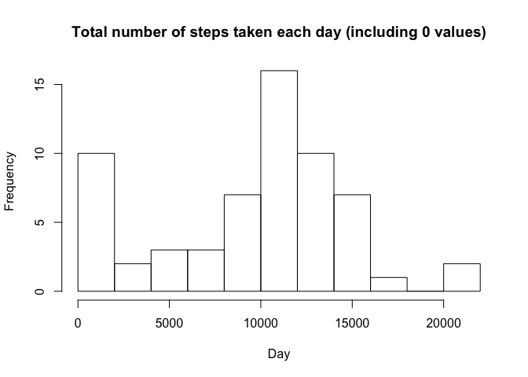
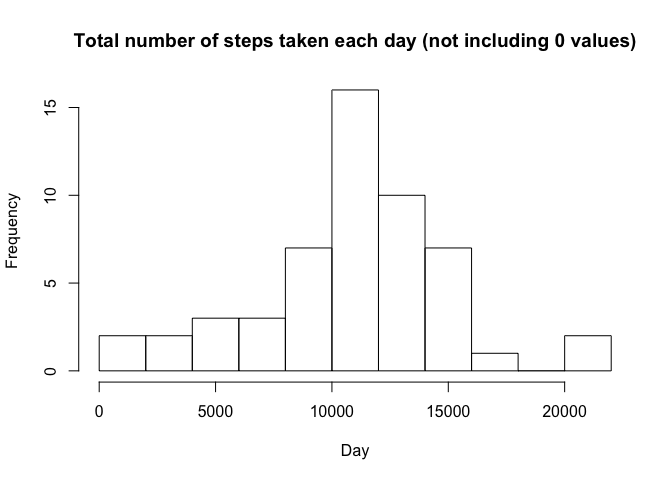
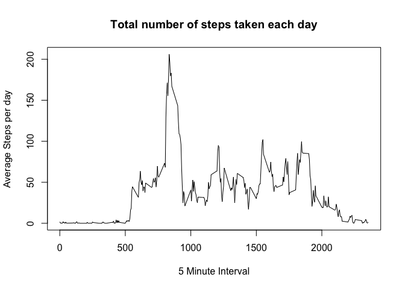
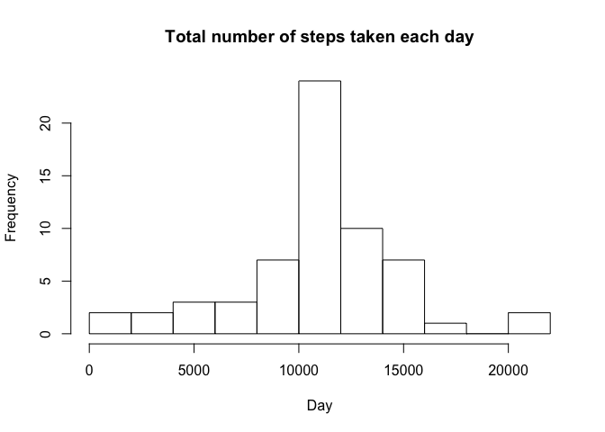
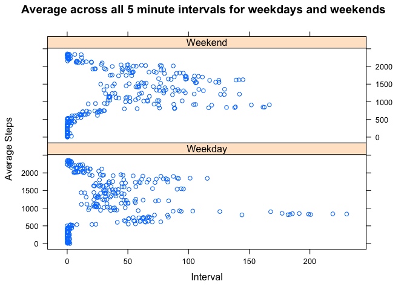

# PA1_template
Nick Tsirlis  
May 14, 2015  
Reproducible Research Coursera Course - Programming Assignment 1

The following document is an R Markdown document containing the text and R code for the first programming assignment in the Reproducible Research Coursera Course.  

#Loading and Preprocessing the data  
First, I set the working directory to the desktop which contains the data file

```r
setwd("~/Desktop")
```

Second, I read in the data into a variable called data

```r
data <- read.csv("activity.csv")
```

Third, I convert the date variable from a factor to a Date date type

```r
str(data)
```

```
## 'data.frame':	17568 obs. of  3 variables:
##  $ steps   : int  NA NA NA NA NA NA NA NA NA NA ...
##  $ date    : Factor w/ 61 levels "2012-10-01","2012-10-02",..: 1 1 1 1 1 1 1 1 1 1 ...
##  $ interval: int  0 5 10 15 20 25 30 35 40 45 ...
```

```r
data$date <- strptime(data$date, "%Y-%m-%d")
data$date <- as.Date(data$date)
str(data)
```

```
## 'data.frame':	17568 obs. of  3 variables:
##  $ steps   : int  NA NA NA NA NA NA NA NA NA NA ...
##  $ date    : Date, format: "2012-10-01" "2012-10-01" ...
##  $ interval: int  0 5 10 15 20 25 30 35 40 45 ...
```

#What is mean total number of steps taken per day?
I calculate the mean 2 seperate ways:  
1. I show the total number of steps taken per day and rename the columns while taking out NA values. Note that this method includes 0 values (total observations = 61)

```r
steps_taken_per_day <- aggregate(data$steps, by=list(data$date), FUN=sum, na.rm=TRUE)
colnames(steps_taken_per_day) <- c("Day", "Steps")
```
2. Same as above except this method does not include 0 values (total observations = 53)

```r
steps_taken_per_day2 = aggregate(steps~date, data=data, FUN=sum, na.rm=TRUE)
colnames(steps_taken_per_day2) <- c("Day", "Steps")
```

Next, I plot a histogram for both methods above showing the total number of steps taken each day

```r
hist(steps_taken_per_day$Steps, main="Total number of steps taken each day (including 0 values)", xlab="Day", breaks = 15)
```

 

```r
hist(steps_taken_per_day2$Steps, main="Total number of steps taken each day (not including 0 values)", xlab="Day", breaks = 15)
```

 

Finally, I calculate the mean and median using both methods  
Method 1:

```r
mean(steps_taken_per_day$Steps)
```

```
## [1] 9354.23
```

```r
median(steps_taken_per_day$Steps)
```

```
## [1] 10395
```
Method 2:

```r
mean(steps_taken_per_day2$Steps)
```

```
## [1] 10766.19
```

```r
median(steps_taken_per_day2$Steps)
```

```
## [1] 10765
```
#What is the Average Daily Activity Pattern?
Create variable that aggregates steps by interval while still ignoring NA values

```r
interval_steps <- aggregate(data$steps, by=list(data$interval), FUN=mean, na.rm=TRUE)
colnames(interval_steps) <- c("Interval", "Steps")
```

Next plot a time series plot 

```r
plot(interval_steps[,1], interval_steps[,2], xlab="5 Minute Interval", ylab="Average Steps per day", main="Total number of steps taken each day", type="l")
```

 

Finally, show which 5 minute interval on average contains the highest number of steps

```r
interval_steps[which.max(interval_steps[,2]),]
```

```
##     Interval    Steps
## 104      835 206.1698
```
#Imputting Missing Values
Calculate the total number of missing values in the dataset. The output shows there are 2,304 missing values in the steps variable

```r
summary(data)
```

```
##      steps             date               interval     
##  Min.   :  0.00   Min.   :2012-10-01   Min.   :   0.0  
##  1st Qu.:  0.00   1st Qu.:2012-10-16   1st Qu.: 588.8  
##  Median :  0.00   Median :2012-10-31   Median :1177.5  
##  Mean   : 37.38   Mean   :2012-10-31   Mean   :1177.5  
##  3rd Qu.: 12.00   3rd Qu.:2012-11-15   3rd Qu.:1766.2  
##  Max.   :806.00   Max.   :2012-11-30   Max.   :2355.0  
##  NA's   :2304
```

Create a copy of the data file that will contain filled in NA values

```r
data2 <- data
```

Missing values are filled in by using the average interval value for that day

```r
for(i in 1:nrow(data2)) {
  if(is.na(data2$steps[i])) {
    data2$steps[i] = subset(interval_steps, Interval == data2$interval[i])$Steps
  }
}
summary(data2)  ## Note that there are no NA values
```

```
##      steps             date               interval     
##  Min.   :  0.00   Min.   :2012-10-01   Min.   :   0.0  
##  1st Qu.:  0.00   1st Qu.:2012-10-16   1st Qu.: 588.8  
##  Median :  0.00   Median :2012-10-31   Median :1177.5  
##  Mean   : 37.38   Mean   :2012-10-31   Mean   :1177.5  
##  3rd Qu.: 27.00   3rd Qu.:2012-11-15   3rd Qu.:1766.2  
##  Max.   :806.00   Max.   :2012-11-30   Max.   :2355.0
```

I show the total number of steps taken per day (using the data set with missing values filled in) and rename the columns while taking out NA values

```r
steps_taken_per_day_complete <- aggregate(data2$steps, by=list(data2$date), FUN=sum, na.rm=TRUE)
colnames(steps_taken_per_day_complete) <- c("Day", "Steps")
```

Next, the histogram shows the total number of steps taken each day

```r
hist(steps_taken_per_day_complete$Steps, main="Total number of steps taken each day", xlab="Day", breaks = 15)
```

 

Lastly, I calculate the mean and median of the data set (note that the output shows that the mean and median are similar to method 2 above which excluded the 0 values)

```r
mean(steps_taken_per_day_complete$Steps)
```

```
## [1] 10766.19
```

```r
median(steps_taken_per_day_complete$Steps)
```

```
## [1] 10766.19
```

#Are there any Differences in Activity Patterns between Weekdays and Weekends?
Create and add a column containing the day of week for that particular day

```r
weekdays <- weekdays(data2$date)
data2$weekday <- weekdays
```

Create and add a column saying if day is a weekday or a weekend

```r
for(i in 1:nrow(data2)) {
  if(data2$weekday[i] == "Saturday" | data2$weekday[i] == "Sunday") {
    data2$daytype[i] <- c("Weekend")
  } else {
    data2$daytype[i] <- c("Weekday")
  }
}
data2$daytype <- as.factor(data2$daytype)
str(data2)
```

```
## 'data.frame':	17568 obs. of  5 variables:
##  $ steps   : num  1.717 0.3396 0.1321 0.1509 0.0755 ...
##  $ date    : Date, format: "2012-10-01" "2012-10-01" ...
##  $ interval: int  0 5 10 15 20 25 30 35 40 45 ...
##  $ weekday : chr  "Monday" "Monday" "Monday" "Monday" ...
##  $ daytype : Factor w/ 2 levels "Weekday","Weekend": 1 1 1 1 1 1 1 1 1 1 ...
```

Create a time series panel plot of the 5 minute interval and average number of steps taken across all 5 minute intervals for weekdays and weekends

```r
interval_steps_complete <- aggregate(data2$steps, by=list(data2$interval, data2$daytype), FUN = mean)
colnames(interval_steps_complete) <- c("interval", "daytype", "steps")

library(lattice)
xyplot(interval~steps|daytype, data=interval_steps_complete, main = "Average across all 5 minute intervals for weekdays and weekends", layout = c(1, 2), xlab = "Interval", ylab="Average Steps")
```

 
